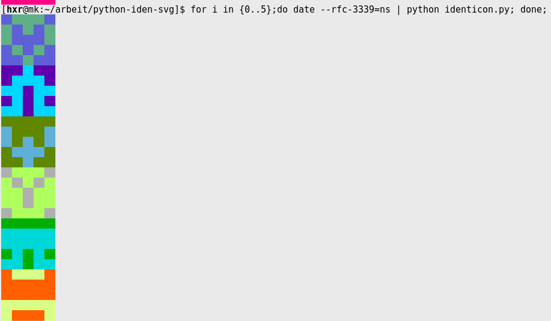

# ASCII Terminal Identicons

This is a Python script which generates identicons based on a given string.
Inspired by [fdcore/python-iden-svg](https://github.com/fdcore/python-iden-svg)

It outputs an ascii block diagram character with foreground colour set for the
different 'pixels' of the identicon.

## How to Use

$ python identicon.py identicon.py
$ cat some-file | python identicon.py
$ hostname -f | python identicon.py

## Examples

## Accessibility Considerations

The background colour is set to the foreground colour + an offset, in order to
avoid the problem of painting a low-contrast colour relative to your terminal
background. Most of the colour pairings are OK, but some are sub-optimal. At
some point I should check it against the WCAG guidelines.

Probably not useful for people with screenreaders. We could change to a
different character for 'background' pixels, but then it's just reading off 25
chars which is kinda useless.

# License

MIT
